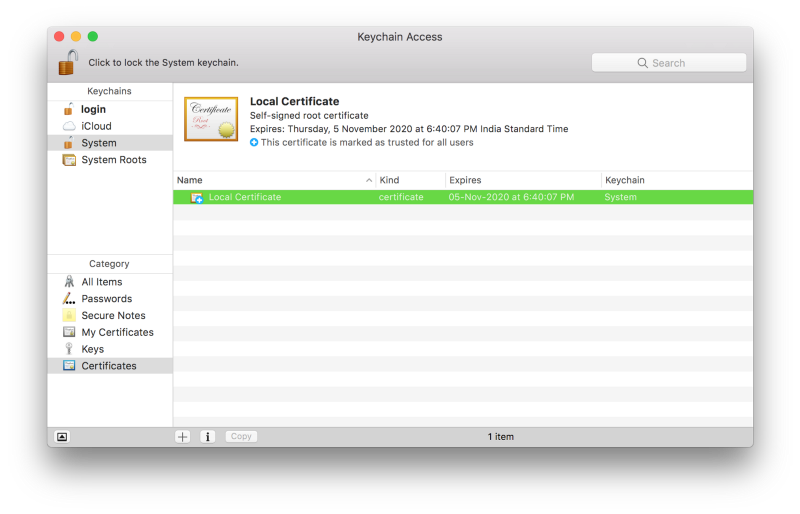

## 第一步
命令行输入命令，生成`rootCA.key`

```
openssl genrsa -des3 -out rootCA.key 2048
```

## 第二步
使用`rootCA.key`生成`rootCA.pem`
```
openssl req -x509 -new -nodes -key rootCA.key -sha256 -days 1024 -out rootCA.pem
```

## 第三步
导入pem证书到电脑




## 第四步
命令行输入命令，生成`server.csr`, `server.key`
```
openssl req -new -sha256 -nodes -out server.csr -newkey rsa:2048 -keyout server.key -config <( cat server.csr.cnf )
```

## 第五步
使用`server.csr`和`rootCA.pem`，生成`server.crt`
```
openssl x509 -req -in server.csr -CA rootCA.pem -CAkey rootCA.key -CAcreateserial -out server.crt -days 500 -sha256 -extfile v3.ext
```

## 第六步
在服务端使用证书
```
key: fs.readFileSync(path.resolve('server.key')),
cert: fs.readFileSync(path.resolve('server.crt'))
```